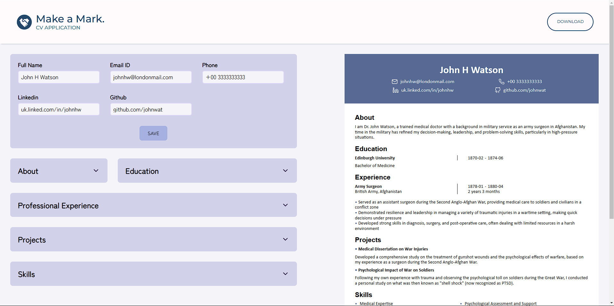

# CV Application

A responsive CV generator application, implemented through React.

Check it out :point_right:[here!](https://make-a-mark.netlify.app/):point_left:

## :joystick: Features

- Fill in the input fields for sections from the user's name and contact details to their experience history and skills
- Flexible options to add, edit and delete sections such as professional experience, projects and skills
- Save button implemented in each section which provides an instant preview of the CV as details are filled in

## :tada: Achievements

- **React** framework's powerful utility is harnessed to build the entire application through a component-based structure, while enjoying the power of UI flexibility alongside logic
- **Vite** is utilized for configuring React template for the project, while also lending its build tools for module bundling and minification for production
- **Responsive design** and **user accessibility** have been prioritized in the implementation while ensuring a clean and seamless user interface

## :magic_wand: Extras!

- **html2pdf** has been utilized to implement a download functionality, which lets user download their CV seamlessly with just a click
- **Constraint validation API** in Javascript has been implemented , notifying users if any invalid or impossible data has been entered in the form

## :page_with_curl: Note

- Modern normalize is used for cross-browser consistency
- ESLint is used for code analysis
